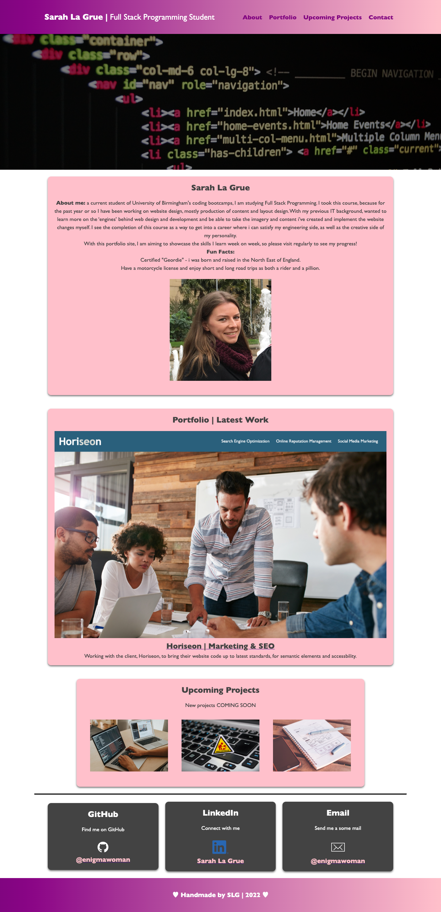

# 02-Advanced-CSS - Portfolio

## Website build

Creation of a personal portfolio, to showcase the skills learnt and projects wokred on throughout the course.

## User Story

* AS AN employer
* I WANT to view a potential employee's deployed portfolio of work samples
* SO THAT I can review samples of their work and assess whether they're a good candidate for an open position

## Acceptance Criteria
* GIVEN I need to sample a potential employee's previous work
* WHEN I load their portfolio
* THEN I am presented with the developer's name, a recent photo or avatar, and links to sections about them, their work, and how to contact them
* WHEN I click one of the links in the navigation
* THEN the UI scrolls to the corresponding section
* WHEN I click on the link to the section about their work
* THEN the UI scrolls to a section with titled images of the developer's applications
* *WHEN I am presented with the developer's first application
* THEN that application's image should be larger in size than the others
* WHEN I click on the images of the applications
* THEN I am taken to that deployed application
* WHEN I resize the page or view the site on various screens and devices
* THEN I am presented with a responsive layout that adapts to my viewport

The main challenge i faced, was the use flexbox layout in CSS. I overcame this by researching other websites using flexbox, looking through tutorials and practising before implementation to my own website.

I hope to optimize further in the future, when i have, more knowledge, further projects and information to add.

## Using the code
I have been careful to use correct semantic structure within the HTML and CSS files, so the code can be easily followed and worked on.

# Portfolio

## Link to deployed application.

<a href="[https://www.google.com/](https://enigmawoman.github.io/02-advanced-css/)" target="_blank">Deployed Portfolio Application</a>

## Screenshot of the finished website 

## License

NA

